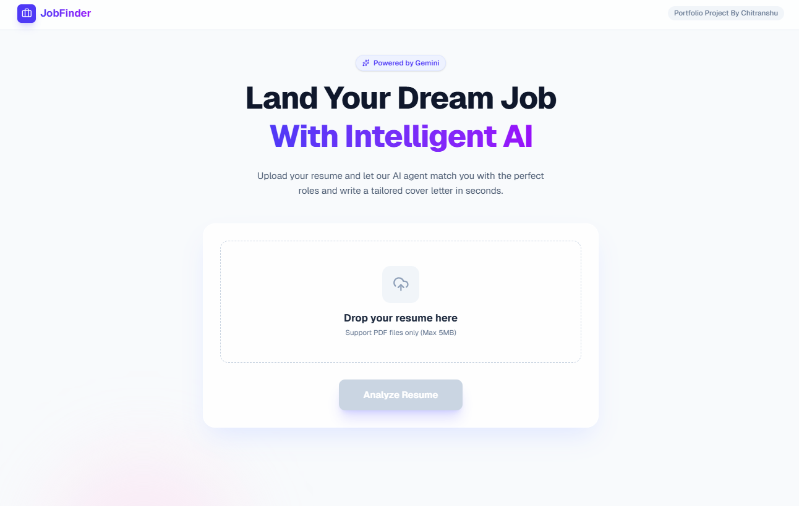
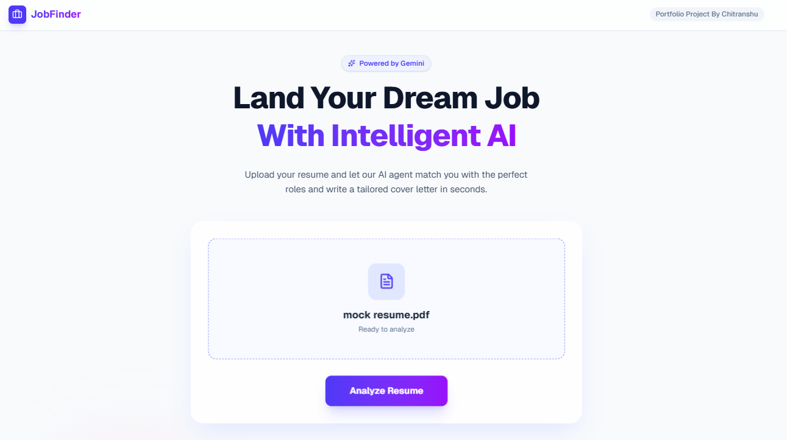
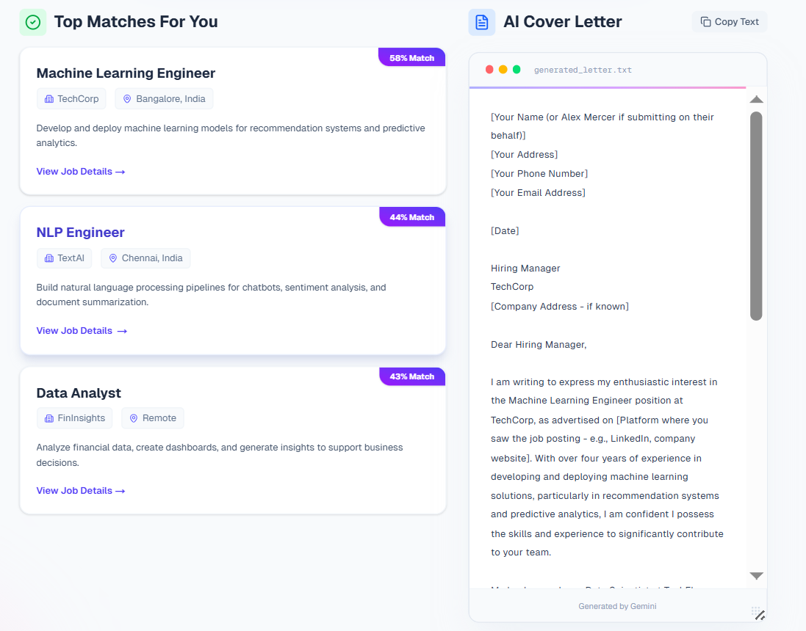

# 🚀 AI Job Application Assistant





A full-stack AI agent that streamlines the job application process. It parses PDF resumes, matches them against a job database using **Vector Similarity Search**, and generates hyper-personalized cover letters using **Google Gemini**.

---

## ✨ Key Features

* **📄 Smart Resume Parsing**
  Extracts and processes text from PDF resumes using `PyPDF`.

* **🧠 Vector Search & Matching**
  Uses **HuggingFace Embeddings** (`all-MiniLM-L6-v2`) to generate high-dimensional vectors and match jobs using cosine similarity.

* **🤖 AI Agent Workflow**
  Built with **LangGraph** to orchestrate parsing, matching, and generation.

* **✍️ Generative AI Cover Letters**
  Uses **Google Gemini 2.0 Flash** to produce professional, context-aware cover letters tailored to each job.

* **🎨 Modern UI**
  Responsive glassmorphic interface using **React/Next.js** + **Tailwind CSS**, featuring smooth animations and resizable elements.

---

## 🛠️ Tech Stack

### **Backend**

* FastAPI
* LangChain & LangGraph
* Google Gemini 2.0 Flash (`langchain-google-genai`)
* HuggingFace Sentence Transformers
* FAISS / NumPy for vector similarity

### **Frontend**

* Next.js 14 (App Router)
* React
* Tailwind CSS
* Axios
* Lucide React Icons

---

## 📂 Project Structure

```bash
job-ai-assistant/
├── backend/
│   ├── main.py            # FastAPI Entry Point
│   ├── agent.py           # LangGraph Agent Logic
│   ├── jobs.json          # Job Database
│   └── requirements.txt   # Python Dependencies
├── frontend/
│   ├── app/
│   │   └── page.tsx       # Main UI Component
│   ├── public/            # Static Assets
│   └── tailwind.config.ts # Styling Config
└── README.md
```

---

## 🚀 Getting Started

### **Prerequisites**

* Python 3.9+
* Node.js & npm
* Google Cloud API Key (for Gemini)

---

## 🔧 1. Backend Setup

### **Create a virtual environment**

```bash
cd backend
python -m venv venv

# Windows
venv\Scripts\activate

# Mac/Linux
source venv/bin/activate
```

### **Install dependencies**

```bash
pip install -r requirements.txt
```

### **Environment Configuration**

Create a `.env` file in the `backend/` folder:

```
GOOGLE_API_KEY=your_google_api_key_here
```

### **Start the Server**

```bash
uvicorn main:app --reload
```

Backend runs on: **[http://localhost:8000](http://localhost:8000)**

---

## 💻 2. Frontend Setup

### **Install dependencies**

```bash
cd frontend
npm install
```

### **Start the application**

```bash
npm run dev
```

Frontend runs on: **[http://localhost:3000](http://localhost:3000)**

---

## 💡 How It Works

1. **Ingestion** — User uploads a PDF resume.
2. **Embedding** — Resume is parsed and converted into embeddings (HuggingFace).
3. **Matching** — Compared with job embeddings from `jobs.json` via cosine similarity.
4. **Generation** — Gemini generates a custom cover letter using the matched job + resume context.
5. **Delivery** — UI displays job matches and streamed cover letter output.

---

## 🔮 Future Improvements

* Add PostgreSQL/Supabase for persistent job storage
* Implement user authentication
* Add automated “Apply Now” email functionality
* Deploy UI to **Vercel**, backend to **Render**
